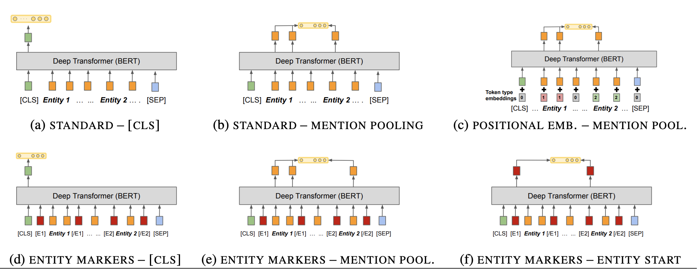
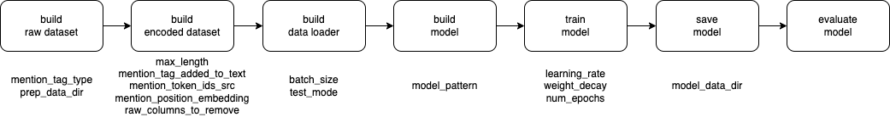
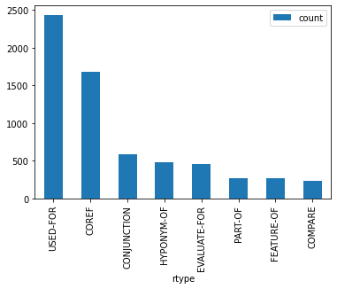

## neural-re-experiments

## Introduction

A repository of experiments with various Transformer based Relation Extraction architectures.

The code here started off as an offshoot of my tutorial on [Transformer based Named Entity Recognition (NER) and Relation Extraction (RE)](https://github.com/sujitpal/ner-re-with-transformers-odsc2022) at ODSC East 2022. In this repository I explore all six architectures referenced in the figure (reproduced below) from the paper [Matching the Blanks: Distributional Similarity for Relation Learning ](https://arxiv.org/abs/1906.03158) by Soares et al (2019).




All six models are implemented in Pytorch, and trained and evaluated using the [SciERC dataset](http://nlp.cs.washington.edu/sciIE/), a collection of 500 scientific abstracts annotated with 6 entity types and 8 relationship types. All Relation Extractions are created by fine-tuning a base pre-trained Transformer model such as BERT. Each architecture has been fine tuned with BERT, DistilBERT and XL-Net.

## Methods

Each abstract in the input can contain multiple (subject, predicate, object) triples. The preprocessing step parses this out into a JSONL file, with each triple in its own record. The format of each record is similar to the SpaCy RE format. We also partition the input 80/10/20 into training, validation and test splits.

The following models, as described in the paper above, are trained and evaluated.

* **Standard - CLS (model A)** -- each input text (multiple sentences in an abstract) is tokenized and padded with a `[CLS]` and `[SEP]` token, and the relation is predicted from the hidden state corresponding to the `[CLS]` token. Note that this provides almost no information, and can even confuse the training, since there can be multiple relation triples within a single input text. 
* **Standard - Mention Pooling (model B)** -- input is similar to model A, but in addition, we capture the position of each of the entity token spans connecting the relation to be predicted. Instead of using the hidden state of `[CLS]`, the representation used for the relationship prediction input is to maxpool over each token spans corresponding to the subject and object entity spans, then concatenated.
* **Positional Embedding - Mention Pooling (model C)** -- Here in addition to the text input, we also provide the positional embedding for the entity token spans by marking them as `token_type_id=1`. Note that our implementation differs slightly from that described in the paper, but we are limited to using the existing `token_type_ids` provided by the transformer model being fine-tuned.
* **Entity Markers - CLS (model D)** -- Input is similar to model C above, but output is just the hidden state corresponding to the `[CLS]` token.
* **Entity Markers - Mention Pooling (model E)** -- The text is pre-procesed to enclose the subject and object entity spans with entity markers `<E1>`, `</E1>`, `<E2>` and `</E2>`. On the output side, the spans (including the entity marker token positions) are maxpooled to create subject and object embeddings, which are then concatenated to produce an input representation for the relation.
* **Entity Markers - Entity Start (model F)** -- This model is the same as the previous model on the input side, but on the output side, instead of maxpooling across the tokens in the subject and object spans, we concatenate only the states corresponding to the start tokens `<E1>` and `<E2>` to produce the input relation type representation.

Note that in the last three models, we only tell the model the position of the subject and object spans, not the entity types associated with these spans. I was curious if the extra information would translate into a corresponding improvement in performance, so I trained and evaluated these three additional models described below.

* **Entity Type Markers - CLS (model D1)** -- Input is text tagged with entity marker tags `<E1:Generic>`, `</E1:Generic>`, ..., `<E2:Task>`, `</E2:Task>` instead of `<E1>`, ..., `</E2>` tags. The relation tag is predicted using the hidden state at the `[CLS]` tag, similar to model D.
* **Entity Type Markers - Mention Pooling (model E1)** -- Test is preprocessed to enclose the subject and object entity spans with entity marker tags `<E1:Generic>`, `</E1:Generic>`, ..., `<E2:Task>`, `</E2:Task>` instead of `<E1>`, ..., `</E2>` tags. On the output side, the spans (including the entity marker token positions) are maxpooled to create subject and object embeddings, which are then concatenated to produce an input representation for the relation.
* **Entity Type Markers - Entity Start (model F1)** -- This model is the same as the previous model on the input side, but on the output side, instead of maxpooling across the tokens in the subject and object spans, we concatenate only the states corresponding to the subject and object start tokens `<E1:*>` and `<E2:*>` to produce the input relation type representation.

All models are trained for 5 epochs using the AdamW optimizer with learning rate `5e-5` and weight decay of `1e-2`. Batch size varied between 32 (the default) and 16 (for large transformer models) to keep within the GPU memory constraints of Colab.

Our initial set of experiments were done using Colab notebooks, but there was a lot of code duplication across notebooks, which led me to refactoring the training code into a single unified pipeline which could be customized for training each of the above model architectures using configuration files.

* prepare.py -- converts raw files in `data/raw` from the SciERC dataset into a set of training, validation, and test input files in SpaCy Relation Extraction format (JSON-L), as well as files listing relations and entities in `data/prepared`.
* train.py -- trains a model described by a configuration file specified on the command line, using the input in `data/prepared`. Writes trained model and tokenizer out to `data/models`. Configuration files for the models described above are in the `configs` folder in the repository.

  ```python train.py -c /path/to/config-file.cfg```
 
The diagram below shows the main components of our pipeline, with a list of properties that are required by each.



## Results

### Metrics

We report performance for each model using the accuracy over the test set and the macro-F1 score over the test set. Macro-F1 scores are provided because the distribution of relations is unbalanced in the dataset.



### Results (Notebook models)

We evaluate against BERT, DistilBERT and XLNet.

| Model                                   | BERT Test Acc | BERT Macro-F1 | DistilBERT Test Acc | DistilBERT Macro-F1 | XLNet Test Acc | XLNet Macro-F1 | 
| --------------------------------------- | ------------- | ------------- | ------------------- | ------------------- | -------------- | -------------- |
| (a) Standard - CLS                      | 0.376         | 0.15          | 0.363               | 0.15                | 0.381          | 0.07           |
| (b) Standard - Mention Pool             | 0.557         | 0.44          | 0.563               | 0.43                | 0.841          | 0.76           |
| (c) Positional Embedding - Mention Pool | 0.573         | 0.45          | N/A                 | N/A                 | 0.843          | 0.78           |
| (d) Entity Markers - CLS                | 0.381         | 0.07          | 0.840               | 0.75                | 0.830          | 0.83           |
| (e) Entity Markers - Mention Pool       | 0.875         | 0.80          | 0.877               | 0.81                | 0.894          | 0.84           |
| (f) Entity Markers - Entity Start       | 0.887         | 0.82          | 0.881               | 0.82                | 0.900          | 0.84           |

### Results (Final models)

| Model                                   | BERT Test Acc | BERT Macro-F1 | DistilBERT Test Acc | DistilBERT Macro-F1 | XLNet Test Acc | XLNet Macro-F1 | 
| --------------------------------------- | ------------- | ------------- | ------------------- | ------------------- | -------------- | -------------- |
| (a) Standard - CLS                      | 0.371         | 0.12          | 0.377               | 0.11                | 0.384          | 0.14           |
| (b) Standard - Mention Pool             | 0.543         | 0.32          | 0.562               | 0.34                | 0.678          | 0.56           |
| (c) Positional Embedding - Mention Pool | 0.540         | 0.30          | N/A                 | N/A                 | 0.675          | 0.55           |
| (d) Entity Markers - CLS                | 0.381         | 0.07          | 0.840               | 0.75                | 0.830          | 0.83           |
| (d1) Entity Type Markers - CLS          | 0.363         | 0.12          | 0.375               | 0.11                | 0.370          | 0.12           |
| (e) Entity Markers - Mention Pool       | 0.835         | 0.73          | 0.827               | 0.70                | 0.746          | 0.64           |
| (e1) Entity Type Markers - Mention Pool | 0.833         | 0.72          | 0.823               | 0.70                | 0.735          | 0.62           |
| (f) Entity Markers - Entity Start       | 0.855         | 0.77          | 0.821               | 0.70                | 0.733          | 0.61           |
| (f1) Entity Type Markers - Entity Start | 0.855         | 0.77          | 0.820               | 0.69                | 0.744          | 0.63           |

### Performance Comparison

TODO

## Future Work

* ~~Would be interesting to test out variations of the six model architectures described in the paper, to understand the effect of model performance in response to increasing the (NER) information used during training.~~
* Would be interesting to try these models out with other popular transformer models such as RoBERTa and ALBERT as well.
* Some other interesting Relation Extraction Datasets are listed below. Each set has a different mix of relation types vs number of examples, it will be interesting to see how the above models perform against them.
  * [SemEval 2010 Task B](http://www.kozareva.com/downloads.html) -- 10 relation types, 10,717 examples
  * [TACRED](https://nlp.stanford.edu/projects/tacred/) -- 41 relation types, 106,264 examples
  * [FewRel](http://www.zhuhao.me/fewrel/) -- 100 relation types, 70,000 examples

